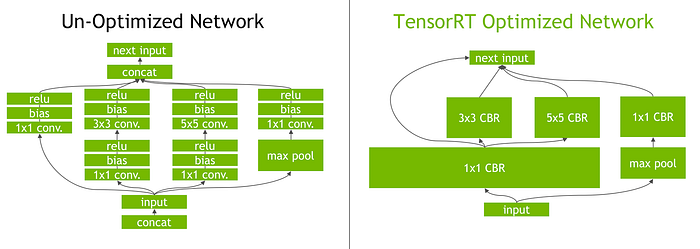

# Pytorch-TensorRT-ONNX

The aim of this repository is to provide simple and easy-to-understand code for converting a Pytorch model to TensorRT using the ONNX format and comparing the inference time of the model in Pytorch, ONNX, and TensorRT. The `trtexec` command line tool did not work for me, so I used the TensorRT Python API for converting the Pytorch model to TensorRT. It also offers more flexibility and customization compared to using `trtexec`. I used the 'ResNet50' model for performing the conversion and inference. The code is run on Google Colab.

## Results
The inference time for Pytorch, ONNX, and TensorRT for a batch size of 32 is as follows:
- Pytorch FP32: 93.9 ms
- Pytorch FP16: 30 ms
- TensorRT FP16: 17.6 ms
- ONNX FP32 (CPU): 3.68 seconds

## Learnings
TensorRT inference is faster than Pytorch and ONNX. The reasons for faster inference in TensorRT are:

1. **Changing the Precision**: TensorRT allows you to change the precision of weight values to optimize memory usage and processing speed. By default, the weight values of a Pytorch model are saved in FP32 (32-bit floating point). While creating a TensorRT engine, you can set the datatype to FP16 (16-bit floating point) or INT8 (8-bit integer), which significantly reduces memory requirements and speeds up processing. For example, just like a human can perform simpler arithmetic operations more quickly, a machine can perform computations involving FP16/INT8 values much faster than those involving FP32 values.

2. **Layer Fusion and Tensor Fusion**: Consider the following operations in Pytorch: `3x3Conv -> Bias -> ReLU()`. In Pytorch, each operation is computed sequentially, which can result in significant memory overhead and increased inference time. TensorRT optimizes this by merging these operations into a single layer (such as `3x3 CBR` shown in the figure). Layer fusion can occur both vertically and horizontally. For example, nodes performing similar operations on similar inputs, like `1x1 Conv -> Bias -> ReLU()`, can be fused into a `1x1 CBR` layer horizontally.  

3. **Kernel Auto-Tuning**: Let's talk about threads, blocks, and grids before talking about kernel auto-tuning. Threads are the smallest unit of execution in CUDA. Threads can be grouped into blocks. Threads within the same block can synchronize and share data efficiently through shared memory. Each block is executed on a single streaming multiprocessor (SM) within the GPU. These blocks can be organized into grids. Grids can be executed independently across multiple SMs on the GPU. A kernel in CUDA refers to a function that runs on the GPU. TensorRT uses several of these kernels to perform operations like convolution, matrix multiplications, etc. During kernel auto-tuning, TensorRT profiles different kernel configurations (number of threads per block, block dimensions, grid size) to find the most efficient setup for the specific GPU architecture and workload. Kernel auto-tuning also involves selecting the best algorithm for each operation, such as the type of convolution, to ensure maximum performance.

4. **Multiple Stream Execution**: In GPU programming, a stream represents a sequence of commands that execute asynchronously on the GPU. Each stream operates independently of other streams and can overlap with the execution of other streams. Let's consider an example where you have three tensors A, B, and C, and you want to perform two separate operations concurrently using multiple streams on a GPU:
    - Operations to Perform: 
        - Operation 1: Compute A + B 
        - Operation 2: Compute B + C 
    - Using Multiple Streams: Two separate streams can be defined to perform these operations concurrently.

5. **Dynamic Memory Allocation**: TensorRT performs lifetime analysis of tensors to determine when they are created and when they are no longer needed. Based on this analysis, TensorRT can plan memory reuse even with static memory allocation while building the engine. TensorRT can reuse memory buffers for different tensors whose lifetimes do not overlap. This means that if a tensor’s memory is no longer needed, that memory can be reassigned to another tensor that needs it next. This reduces the amount of memory that needs to be allocated and deallocated during inference, which can improve performance.

The reason for slower inference in ONNX is that the model is run using the `CPUExecutor`. I tried to run the model using the `CUDAExecutor`. Even though the model was loaded on GPU, the inference session was still running with `CPUExecutor`. I believe this is due to the mismatch between versions of `onnxruntime-gpu` (1.18), CUDA (12.2), and cuDNN (8.9.6). The required versions for `onnxruntime-gpu` (1.18)are CUDA (12.4), and cuDNN (8.9.2.26) as mentioned in the [ONNX Runtime documentation](https://onnxruntime.ai/docs/execution-providers/CUDA-ExecutionProvider.html#requirements).

